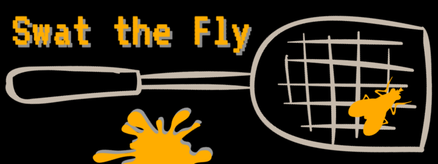

--

### How to Play:

Both players enter their names. After submitting, click the start button when player one is ready.

Using your mouse or finger, find the fly and click on it to earn a point.

Each player has 15 seconds to swat the fly as best as they can. 

The player with the most successful "swats" [points] is declared the winner. The winner has 10 seconds to gloat and the game will restart.

Ready? [PLAY HERE](https://kcmckenna.github.io/swat-the-fly/?)

--
### Built With:

- HTML, CSS, JavaScript and jQuery library.
- 'VT323' font from Google.com/fonts
- Sounds provided by Soundbible.com
- Images found online, links provided in comments of code.

### Design Approach

- Created movement logic for the fly
- Set timer to begin on click of start button
- Created time limit for when points can be added to score
- Switch players logic based on turns taken
- Points created for each successful "swat"
- Declare winner with highest score
- Set page to reload to play again.

### Unsolved Problems

- Have game adapt to changing screensize
- Make it more mobile friendly
- Improve the CSS/Styling of the page
- Fix any unforseen bugs `;)`

### Future Goals

- Cumulative score tracking
- Better fly movement
- Pick your bug to splat
- Realistic splat on screen

## Acknowledgments

Thanks to GA, my instructors & T.A.'s, Google searches, [LogoMakr](https://logomakr.com/) for the logo, and the unhealthy amount of coffee consumed to help make this game function properly.

